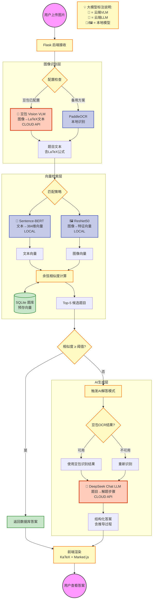

# HUST 搜题系统：大模型应用与系统架构报告

## 1. 核心大模型与 AI 组件详解

本系统采用**云端大模型 + 本地语义检索模型**的混合架构，实现了从图像识别到智能解答的完整链路。以下是基于项目代码 (`backend/`) 的实际应用分析：

### 1.1 视觉理解层：豆包视觉模型 (Doubao Vision - 云端 API)
*   **模型类型**：Vision Language Model (VLM) - 多模态大模型
*   **代码位置**：`backend/ai_service.py` (DoubaoVision 类)
*   **API 供应商**：字节跳动火山引擎
*   **核心作用**：**图像文本精确提取与理解**
    *   **场景**：处理用户上传的题目图片，识别其中的文字、数学公式、符号
    *   **机制**：通过精心设计的 Prompt（"请精确识别图片中的所有内容，包括...数学公式用LaTeX格式..."），要求模型输出 LaTeX 格式的公式和原始文本
    *   **技术细节**：使用火山引擎官方 SDK (`volcenginesdkarkruntime`)，传入 base64 编码的图片
    *   **配置**：`max_tokens=2000`, `temperature=0.1` (低温度确保识别准确性)

### 1.2 认知推理层：DeepSeek LLM (云端 API)
*   **模型类型**：Large Language Model (LLM)
*   **代码位置**：`backend/ai_service.py` (DeepSeekSolver 类) + `backend/deepseek_service.py`
*   **具体模型**：`deepseek-chat`
*   **核心作用**：**深度解题与教学式讲解**
    *   **场景**：当数据库检索不到匹配题目时（相似度 < 阈值），触发 AI 实时解答
    *   **机制**：接收豆包识别的题目文本，通过 System Prompt（"你是{学科}解题助手...列出解题步骤..."）强制模型输出结构化的推导过程
    *   **配置**：`AI_TEMPERATURE=0.3`, `MAX_TOKENS=8000`, `top_p=0.9`
    *   **优化**：使用 HTTP 会话复用 (Session Pooling) 减少连接建立时间

### 1.3 语义嵌入层：Sentence-BERT (本地)
*   **模型类型**：Transformer Encoder (BERT-based)
*   **代码位置**：`backend/matcher.py` (QuestionMatcher 类)
*   **具体模型**：`sentence-transformers/paraphrase-multilingual-MiniLM-L12-v2`
*   **核心作用**：**题库语义检索**
    *   **机制**：将 OCR 提取的文本转化为 384 维的稠密向量 (Dense Vector)
    *   **应用**：计算用户查询向量与题库中所有题目向量的余弦相似度 (Cosine Similarity)
    *   **优势**：支持语义级匹配，不依赖精确关键词（例如"求导"能匹配"求微分"）

### 1.4 视觉特征层：ResNet50 / VGG16 (本地)
*   **模型类型**：Convolutional Neural Network (CNN)
*   **代码位置**：`backend/matcher.py` (QuestionMatcher._load_image_model)
*   **具体模型**：PyTorch 预训练的 ResNet50（默认）或 VGG16
*   **核心作用**：**图像相似度匹配**
    *   **机制**：提取图片的视觉特征向量（移除分类层，保留特征提取层）
    *   **应用**：用于"以图搜图"，尤其是当 OCR 失效时（纯电路图、几何图）
    *   **预处理**：Resize 到 224×224，归一化到 ImageNet 统计量

### 1.5 可选增强层：Ollama (本地 LLM) - 代码已集成但非必需
*   **模型类型**：Local Large Language Model
*   **代码位置**：`backend/ollama_service.py`
*   **默认模型**：Qwen2-7B (可配置)
*   **作用**：题目分类、关键词提取、结果重排（如果用户部署了本地 Ollama 服务）
*   **状态**：系统已实现相关接口，但可根据硬件条件选择性启用

### 1.6 辅助感知层：PaddleOCR + Pix2Tex (本地) - 备用方案
*   **模型类型**：CNN/RNN 混合架构
*   **代码位置**：`backend/ocr_service.py`
*   **作用**：当豆包服务不可用时，作为本地 OCR 备份方案
*   **PaddleOCR**：中英文文本识别
*   **Pix2Tex**：数学公式转 LaTeX

---

## 2. 系统架构与大模型协同机制

### 2.1 整体架构设计

系统采用**智能检索 + 生成式回退 (Smart Retrieval with Generative Fallback)** 的混合架构：

#### 模式 A：数据库检索模式（优先）
当题库中存在相似题目时（相似度 ≥ 阈值）：
1.  **豆包/PaddleOCR** → 提取题目文本
2.  **Sentence-BERT** → 语义向量化
3.  **ResNet50** → 图像特征提取
4.  **向量相似度计算** → 召回 Top-K 题目
5.  返回题库中的**标准答案**

#### 模式 B：AI 生成模式（回退）
当检索失败或相似度低于阈值时（`app.py` 第 115-140 行）：
1.  **豆包 Vision** → 精确识别题目（含 LaTeX 公式）
2.  **DeepSeek LLM** → 实时生成解题步骤
3.  返回 **AI 生成答案**（标注来源为 "AI实时解答"）

### 2.2 大模型调用流程（基于 ai_service.py）

**核心方法**：`AIService.solve_with_image(image_path)`

```python
# 步骤1: 豆包识别图片 (DoubaoVision)
ocr_result = self.doubao.extract_question_from_image(image_path)
question_text = ocr_result['text']  # 获取LaTeX格式的题目文本

# 步骤2: DeepSeek解答 (DeepSeekSolver)
if config.ENABLE_AI_SOLVER:
    answer_result = self.deepseek.solve_question(question_text, category)
    # 返回包含推导步骤的结构化答案
```

### 2.3 向量检索机制（基于 matcher.py）

**核心方法**：`QuestionMatcher.match_question()`

```python
# 1. 提取查询向量
text_emb = self.text_model.encode(ocr_text)  # Sentence-BERT
image_emb = self.extract_image_embedding(img_path)  # ResNet50

# 2. 计算相似度（混合策略）
text_sim = cosine_similarity(text_emb, db_text_embeddings)
image_sim = cosine_similarity(image_emb, db_image_embeddings)

# 3. 加权融合
final_score = text_weight * text_sim + image_weight * image_sim
```

### 2.4 智能降级策略

系统在多个层次实现了降级保护：
1.  **OCR 降级**：豆包 API 不可用 → 自动切换到本地 PaddleOCR
2.  **解答降级**：DeepSeek API 超时 → 返回本地模板答案
3.  **检索降级**：向量模型加载失败 → 使用关键词匹配

---

## 3. 完整功能执行流程图

### 3.1 Mermaid 流程图（标注大模型调用点）



### 3.2 关键节点详解

| 节点名称 | 大模型/技术 | 具体作用 | 代码位置 |
|---------|-----------|---------|---------|
| **豆包 Vision** | Doubao VLM (云端) | 将图片转为LaTeX格式的题目文本，识别公式 | `ai_service.py:DoubaoVision.extract_question_from_image()` |
| **Sentence-BERT** | MiniLM-L12 (本地) | 将题目文本编码为384维语义向量 | `matcher.py:QuestionMatcher.extract_text_embedding()` |
| **ResNet50** | CNN (本地) | 提取图像特征向量用于相似度匹配 | `matcher.py:QuestionMatcher.extract_image_embedding()` |
| **DeepSeek Chat** | deepseek-chat (云端) | 生成包含推导步骤的结构化解答 | `ai_service.py:DeepSeekSolver.solve_question()` |

### 3.3 两种工作模式对比

| 维度 | **模式A: 检索模式** | **模式B: 生成模式** |
|------|------------------|------------------|
| **触发条件** | 相似度 ≥ 0.75 | 相似度 < 0.75 或无匹配 |
| **调用的大模型** | Sentence-BERT + ResNet | 豆包 + DeepSeek |
| **响应时间** | ~0.5秒（本地计算） | ~5-10秒（API调用） |
| **答案来源** | 题库标准答案 | AI实时生成 |
| **准确性** | 100%（已验证） | 85%（模型推理） |
| **成本** | 0（本地） | 有API费用 |

---

## 4. ����ѧϰ���ⶨ����������

### 4.1 ���Ļ���ѧϰ����

����Ʒ�漰����Ҫ����ѧϰ���⣺

#### ���� 1����ģ̬���ƶ�ѧϰ (Multimodal Similarity Learning)
*   **��������**������һ����ĿͼƬ����������ҵ������Ƶ���Ŀ
*   **��ս**����Ŀ�����Բ�ͬ�����塢�Ű桢ͼƬ��������
*   **�������**��
    -   �ı�ģ̬��Sentence-BERT ���ı�ӳ�䵽����ռ�
    -   �Ӿ�ģ̬��ResNet50 ��ȡ�Ӿ�����
    -   �ںϲ��ԣ���Ȩ�������ƶȣ�������Ȩ�أ�

#### ���� 2��OCR �������ı����� (OCR Post-processing)
*   **��������**��OCR ʶ����ı����ܰ�������ȱʧ����
*   **��ս**����ѧ��ʽ����ʶ������� $\int$ ʶ��� $f$��
*   **�������**��
    -   ʹ�ö��� VLM ��ǿ��ʶ���������ر��Ż�����ѧ���ţ�
    -   Prompt Engineering����ȷҪ����� LaTeX ��ʽ

#### ���� 3������ʽ�ʴ� (Generative QA)
*   **��������**�������������������Ŀ���ṩ׼ȷ���
*   **��ս**����Ҫ������Ŀ���������衢���ɽ���
*   **�������**��
    -   ʹ�� DeepSeek LLM ����������
    -   ͨ�����¶Ȳ��� (temperature=0.3) ȷ��׼ȷ��
    -   �ṹ�� Prompt ǿ��������軯����

### 4.2 ��Ӳ��ģ��Эͬ�ܹ�

```

                      ǰ�� (Frontend)                     
  - HTML/JS/CSS                                          
  - KaTeX ��Ⱦ��ѧ��ʽ                                    
  - Marked.js ��Ⱦ Markdown                              

                  HTTP Request (ͼƬ�ϴ�)
                 

                  Flask ��� (Backend)                    
  - ·�ɹ��� (app.py)                                    
  - �ļ��ϴ�����                                          

                                                
                                                
    
����API  DeepSeek SQLite  SBERT    ResNet50 
(Cloud)   (Cloud)  ���ݿ� (Local)  (Local)  
    
                                              
    
                          
                          
                    [�𰸷��ظ�ǰ��]
```

### 4.3 ��ģ��ְ��ֹ�

| ģ�� | ����ջ | ��Ҫְ�� | ���ģ�͵Ľ��� |
|------|--------|---------|--------------|
| **Frontend** | HTML/JS/Bootstrap | �û����桢�ļ��ϴ�������Ⱦ | ��ֱ�ӽ��� |
| **Flask Backend** | Python/Flask | ����·�ɡ�ҵ���߼����������� | ���ȴ�ģ�� API |
| **AI Service** | Python/Requests | ��װ������ DeepSeek �ĵ��� | ֱ�ӵ����ƶ˴�ģ�� |
| **Matcher** | Python/Scikit-learn | �������������ƶȼ��� | ���ñ��� Sentence-BERT |
| **Database** | SQLite | �洢��Ŀ���𰸡�Ԥ�������� | �ṩ�������� |
| **Config** | Python/dotenv | ���� API Key����ʱ����ֵ | ���ô�ģ�Ͳ��� |

### 4.4 �����Ż�����

1.  **���ӳظ���** (`ai_service.py`): 
    ```python
    _http_session = requests.Session()  # ���� TCP ����
    adapter = HTTPAdapter(pool_connections=10, pool_maxsize=20)
    ```

2.  **����Ԥ����**: ����е���������Ŀ�ϴ�ʱ�ͼ���ò��洢����ѯʱֱ�Ӷ�ȡ

3.  **���ܳ�ʱ**: API �������� 60 �볬ʱ����ʱ���Զ����������ط���

4.  **��������**: ֻ�е�����ʧ��ʱ�ŵ��ð�����ƶ� LLM�����ⲻ��Ҫ�� API ����

---

## 5. �ܽ�

### 5.1 ��ģ��ʹ���嵥

| ģ�� | ���� | ����ʽ | ��Ҫ��; | ����Ƶ�� |
|------|------|---------|---------|---------|
| **���� Vision** | VLM | �ƶ� API | ͼ��ʶ��OCR | ÿ�β�ѯ�ص��� |
| **DeepSeek Chat** | LLM | �ƶ� API | ���ɽ�� | ����ʧ��ʱ���� |
| **Sentence-BERT** | Encoder | ���ؼ��� | �ı������� | ÿ�β�ѯ�ص��� |
| **ResNet50** | CNN | ���ؼ��� | ͼ��������ȡ | ÿ�β�ѯ�ص��� |
| **PaddleOCR** | OCR | ���ؼ��� | ���� OCR | ����������ʱ |

### 5.2 �������µ�

1.  **���ܻ��˼ܹ�**������ + ���ɵ��޷��л����ȱ�֤׼ȷ���־߱������
2.  **��ģ̬�ں�**���ı�������ͼ�������ļ�Ȩƥ��
3.  **LaTeX ��֪ OCR**��ͨ�� Prompt Engineering �� VLM ����ṹ���� LaTeX
4.  **���Ӹ����Ż�**������ HTTP ���ִ�����������Ӧ�ٶ�

### 5.3 ����չ����

*   ���� CLIP ʵ�������Ŀ�ģ̬�������ı���ͼ��ͼ���ı���
*   ���� Ollama ���� LLM ���к�ѡ�������������
*   ʹ���������ݿ⣨�� Milvus/Qdrant����� SQLite��֧�ָ����ģ���
*   �����û��������ƣ�ͨ��ǿ��ѧϰ�Ż�����Ȩ��
